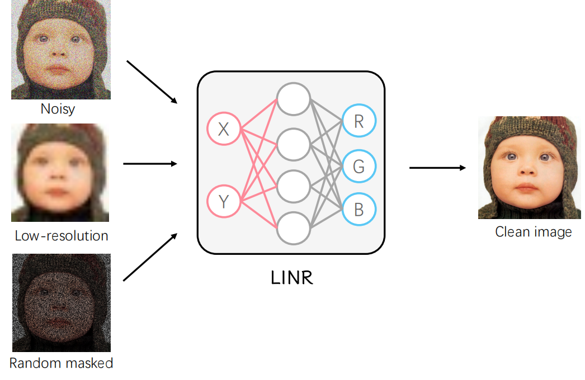

# Revisiting Implicit Neural Representations in Low-Level Vision
### [Paper](https://wentxul.github.io/LINR-projectpage/Revisiting Implicit Neural Representations in Low-Level Vision_files/workshop_Revisiting_Implicit_Neural_Representations_in_Low_Level_Vision.pdf) | [Project Page](https://wentxul.github.io/LINR-projectpage/) 

This repository provides the implementation of the paper:

Wentian Xu and Jianbo Jiao. *[Revisiting Implicit Neural Representations in Low-Level Vision]()*. In ICLR-[NF](https://sites.google.com/view/neural-fields) (2023).

<!--  -->


We provide Jupyter Notebooks for each task in the paper. We also provide a denosing example based on .py file.

---
## Setup
To install the dependencies into a new conda environment, simply run:
```bash
conda env create -f environment.yml
source activate linr
```
Alternatively, you may install them manually:
```bash
conda create --name linr
source activate linr
conda install python = 3.6
conda install pytorch = 1.12 torchvision cudatollkit = 11.6 -c pytorch
conda install numpy
conda install matplotlib
conda install scikit-image
conda install jupyter
```


---
## How to run

1. Change the file path in jupyter Notebooks or in `train_denoising.py` to the image you want
2. Run each cell in jupyter Notebooks or run the code in `train_denoising.py`

### Data
The data used in the paper is stored in the data folder. You can also use your own data by changing the file path.


---
## Citation
If you find LINR useful, please cite the following BibTeX entry:
```
@inproceedings{linr,
  title={Revisiting Implicit Neural Representations in Low-Level Vision},
  author={Wentian Xu and Jianbo Jiao},
  booktitle="International Conference on Learning Representations Workshop",
  year={2023},
}
```

## Achnowledgement
Part of the code is based on DIP(https://github.com/DmitryUlyanov/deep-image-prior), SIREN() and DeepRED ().
